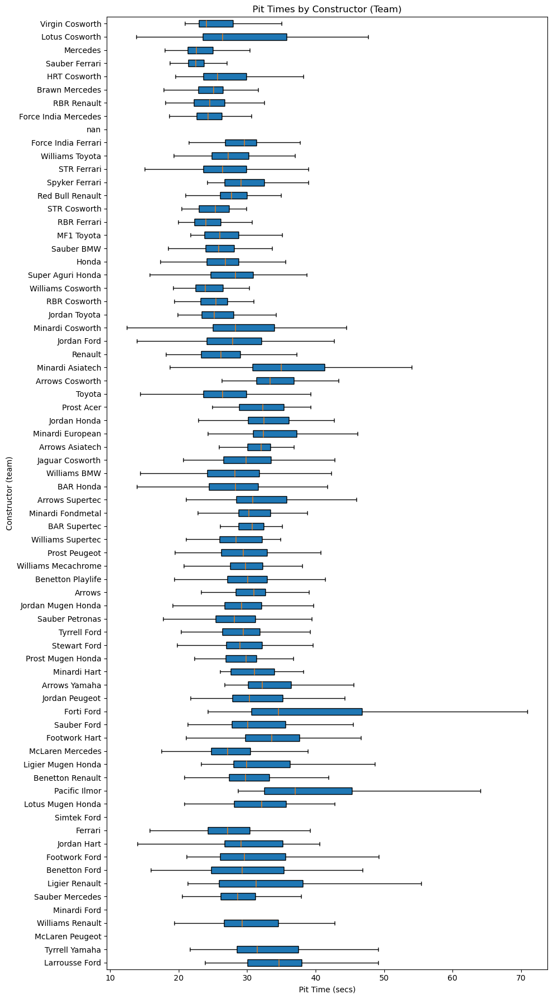
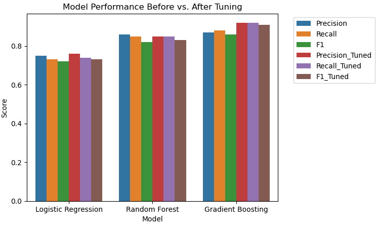
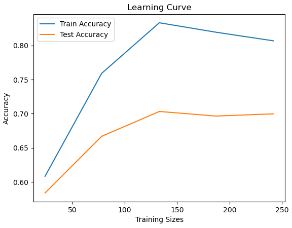

# Formula One Race Strategy Analysis

## Overview
This project analyzes Formula One pit stop and race data to understand how pit stop timing and race conditions impact overall race performance. The main goal was to explore how data-driven insights can help better inform race strategy decisions and identify patterns that contribute to more optimal and faster race strategies for Formula One teams.

## Key Features
- Data cleaning and preprocessing of pit stop and race datasets
- Exploratory Data Analysis (EDA) on pit stop timing performance
- Feature engineering (e.g. pit stop duration, lap timing patterns/classifications)
- Visualization of trends across drivers and races
- Application of machine learning models (Logistic Regression, Random Forest, Gradient Boosting) to analyze performance factors.
- Hyperparameter tuning performed on machine learning models to boost performance.

## Tech Stack
- Python
- NumPy
- Pandas
- scikit-learn
- Matplotlib
- Seaborn
- Jupyter Lab

## How It Works
1. Raw race and pit stop data is loaded and cleaned
2. Raw data visualized for initial insights of the data's structure and distribution
3. Features are engineered to capture performance metrics
4. Data is analyzed to identify key trends in pit stop timing and race outcomes
5. ML models are applied to evaluate key factors of performance, then visualized based on initial results
6. Hyperparameter tuning is performed on models to boost accuracy and precision using GridSearchCV
7. Final results are visualized to communicate insights

## Key Insights
- Pit stop timing has a measurable impact on race performance
- Faster pit stop times generally correlate with improved race outcomes
- Strategic timing plays a critical role in performance, not just speed alone

## Key Visualizations

### Pit Stop Times By Constructor

This boxplot compares pit stop time distributions across different constructors, showing differences in median pit time, variability, and consistency between teams.

### Model Performance Before and After Tuning

This chart compares precision, recall, and F1 scores before and after applying hyperparameter tuning across the three models used for model training: Logistic Regression, Random Forest, and Gradient Boosting.

### Learning Curve

This learning curve compares training and test accuracy with the size of the training dataset, which helps evaluate model generalization and whether additional data may improve model performance.

### Full Analysis

The complete exploratory data analysis, visualizations, feature engineering, model training/evaluation are included in this Jupyter Notebook:
[View Jupyter Notebook](pitstops.ipynb)

## Why This Project Matters
This project demonstrates how data science and machine learning can be used to analyze complex real-world systems like motorsports data and support strategic decision-making. It also underscores the importance of combining data analysis, feature engineering, and modeling to derive meaningful insights.

## Future Improvements
- Incorporate additional race factors (tire compound, weather, track conditions)
- Use more advanced ML models for predictive strategy optimization
- Expand dataset to include multiple seasons for deeper analysis
